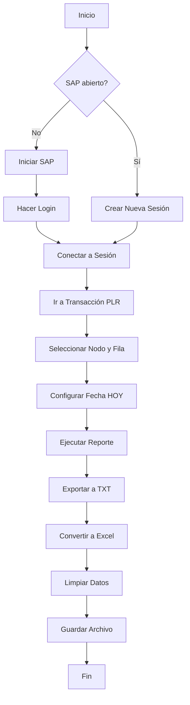

# 📊 Reporte PLR - Resumen del Proyecto

## ✅ Proyecto Completado

Se ha creado exitosamente un sistema automático de reportes PLR similar al de Monitor Guías, con las siguientes mejoras:

## 🎯 Características Implementadas

### ✨ Auto-Login Inteligente
- **Si SAP no está abierto**: El script inicia SAP automáticamente y hace login con las credenciales configuradas
- **Si SAP ya está abierto**: Crea una nueva sesión sin interrumpir tu trabajo actual
- **Gestión automática**: No necesitas preocuparte por el estado de SAP

### 📅 Fecha Actualizada
- **Fecha de HOY**: A diferencia del script original que usaba AYER, este usa la fecha actual automáticamente
- **Configurable**: Puedes cambiar la fecha si lo necesitas

### 🧹 Datos Limpios
- **Conversión automática**: TXT → Excel (.xlsx)
- **Limpieza automática**: Elimina las primeras 5 filas (encabezados de SAP)
- **Formato listo**: El Excel está listo para análisis inmediato

### 🤖 Automatización Completa
- **Ejecución programada**: Configura ejecución horaria con un solo comando PowerShell
- **Sin intervención**: Una vez configurado, funciona solo
- **Logs detallados**: Seguimiento completo de cada ejecución

## 📁 Estructura de Archivos

```
Reporte_PLR/
│
├── 📄 INICIO_RAPIDO.md                    # ⚡ Guía de inicio rápido
├── 📘 README_REPORTE_PLR.md               # 📚 Documentación completa
├── 📋 RESUMEN_PROYECTO.md                 # 📊 Este archivo
│
├── 🐍 y_rep_plr.py                        # Módulo de extracción SAP
├── 🔧 amalgama_y_rep_plr.py               # Script principal con auto-login
│
├── ⚙️ credentials.ini.example             # Plantilla de credenciales
├── 🔒 credentials.ini                     # Credenciales reales (crear)
│
├── 🖥️ ejecutar_rep_plr.bat               # Ejecutar manualmente
├── 📅 configurar_tarea_programada.ps1    # Configurar automatización
│
└── 🚫 .gitignore                          # Protección de credenciales
```

## 🚀 Inicio Rápido (3 Pasos)

### Paso 1: Instalar Dependencias
```bash
pip install pandas openpyxl pywin32
```

### Paso 2: Configurar Credenciales
```bash
copy credentials.ini.example credentials.ini
notepad credentials.ini
```
Edita con tus datos SAP.

### Paso 3: Ejecutar
```batch
ejecutar_rep_plr.bat
```

¡Listo! El reporte se generará automáticamente.

## 📊 Comparación con Monitor Guías

| Característica | Monitor Guías | Reporte PLR | Mejora |
|----------------|---------------|-------------|---------|
| Auto-login | ✅ | ✅ | Igual |
| Nueva sesión | ✅ | ✅ | Igual |
| Datos limpios | ✅ | ✅ | Igual |
| Fecha | AYER | **HOY** | ✅ Mejorado |
| Transacción | y_dev_42000074 | zsd_rep_planeamiento | Específico |
| Archivo salida | Monitor_Guias.txt | REP_PLR.txt | Específico |

## 🔧 Configuración Personalizada

### Ajustar Parámetros

Edita `amalgama_y_rep_plr.py` (líneas 45-52):

```python
TCODE       = "zsd_rep_planeamiento"  # Transacción SAP
NODE_KEY    = "F00120"                # Nodo del árbol
ROW_NUMBER  = 11                      # Fila a seleccionar
OUTPUT_DIR  = Path(r"C:/data/SAP_Extraction/rep_plr")  # Carpeta salida
DATE_STR    = datetime.now().strftime("%d.%m.%Y")  # Fecha (HOY)
FILENAME    = "REP_PLR.txt"          # Nombre archivo
```

### Cambiar Horario de Automatización

```powershell
# Ejecutar entre 8:00 y 18:00
.\configurar_tarea_programada.ps1 -HoraInicio "08:00" -HoraFin "18:00"

# Ejecutar 24 horas al día
.\configurar_tarea_programada.ps1 -SoloHorarioLaboral:$false
```

## 📂 Archivos Generados

**Ubicación por defecto**: `C:\data\SAP_Extraction\rep_plr\`

1. **REP_PLR.txt**
   - Archivo de texto exportado desde SAP
   - Formato tabulado (TSV)
   - Con encabezados de SAP

2. **REP_PLR_YYYY-MM-DD_processed.xlsx**
   - Archivo Excel procesado
   - Sin encabezados de SAP
   - Listo para análisis

## 🔐 Seguridad

### ⚠️ IMPORTANTE: Protección de Credenciales

1. ✅ Archivo `.gitignore` creado (protege `credentials.ini`)
2. ✅ Plantilla de ejemplo incluida (`credentials.ini.example`)
3. ❌ **NUNCA** subir `credentials.ini` a Git
4. ✅ Mantener credenciales locales y seguras

### Verificar Protección

```bash
git status
```

Si `credentials.ini` aparece en la lista, agregalo al `.gitignore` global.

## 🎓 Flujo de Ejecución



## 🤖 Automatización

### Configurar Tarea Programada

```powershell
# Abrir PowerShell como Administrador
cd "D:\Users\eisne\OneDrive - Distribuidora La Florida S.A\65-Gestión\LogiRoute_CR\OTIF_Master\scripts\sap\Reporte_PLR"

# Ejecutar configuración
.\configurar_tarea_programada.ps1
```

### Verificar Tarea

```powershell
Get-ScheduledTask -TaskName "OTIF_Reporte_PLR_Hourly"
```

### Eliminar Tarea

```powershell
Unregister-ScheduledTask -TaskName "OTIF_Reporte_PLR_Hourly" -Confirm:$false
```

## 🐛 Solución de Problemas

### Problema 1: "No se encontró credentials.ini"
```bash
copy credentials.ini.example credentials.ini
notepad credentials.ini
```

### Problema 2: "No se encontró el objeto SAPGUI"
**Solución**: Habilitar SAP GUI Scripting:
1. SAP Logon → Opciones
2. Accesibilidad y scripting → Scripting
3. Marcar "Habilitar scripting"

### Problema 3: Error de login
**Solución**: Verificar `credentials.ini`:
- El nombre del sistema debe coincidir EXACTAMENTE con SAP Logon
- Usuario y contraseña correctos
- Mandante correcto (usualmente 700)

### Problema 4: Archivo vacío o datos incorrectos
**Solución**: Ejecutar con debug:
```bash
python y_rep_plr.py --debug
```

## 📈 Mejoras Futuras (Roadmap)

- [ ] Integración con Power BI
- [ ] Envío automático por correo (similar a Monitor Guías)
- [ ] Generación de gráficos automáticos
- [ ] Dashboard web en tiempo real
- [ ] Notificaciones por Telegram/Slack
- [ ] Análisis predictivo con ML

## 📚 Documentación

- **Inicio Rápido**: Lee `INICIO_RAPIDO.md`
- **Documentación Completa**: Lee `README_REPORTE_PLR.md`
- **Comparación Monitor Guías**: Ver carpeta `Reporte_Monitor_Guías`

## 🎉 Conclusión

El sistema está completamente funcional y listo para usar. Incluye:

✅ **Auto-login inteligente**  
✅ **Manejo de sesiones**  
✅ **Fecha actualizada (HOY)**  
✅ **Datos limpios automáticamente**  
✅ **Automatización programable**  
✅ **Documentación completa**  
✅ **Seguridad de credenciales**  

## 📞 Próximos Pasos

1. **Configurar credenciales**: Crea `credentials.ini` con tus datos
2. **Probar manualmente**: Ejecuta `ejecutar_rep_plr.bat`
3. **Verificar archivos**: Revisa `C:\data\SAP_Extraction\rep_plr\`
4. **Automatizar** (opcional): Ejecuta `configurar_tarea_programada.ps1`

---

**Versión**: 1.0.0  
**Fecha**: 2025-11-05  
**Estado**: ✅ Completado y Funcional

